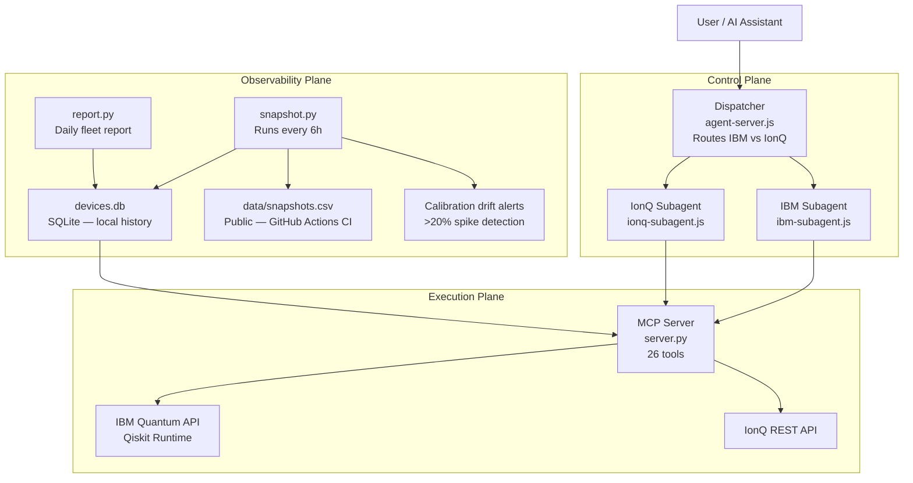

# Quantum Hardware MCP Server

A production MCP server that gives AI assistants programmatic access to live quantum hardware — IBM Quantum and IonQ. Natural language in. Real quantum results out. No dashboards. No manual API calls.

Built in collaboration with [Jack Woehr](https://github.com/jwoehr) — IBM Quantum veteran, Qiskit contributor.

Listed on [Glama](https://glama.ai), [mcp.so](https://mcp.so), and [PulseMCP](https://pulsemcp.com).

---

## Why this exists

Quantum researchers lose hours to operational overhead:

- Manually checking which device has the lowest error rate today
- Submitting the same circuit to IBM, then separately to IonQ, then comparing by hand
- Losing reproducibility context between runs — "what was the CX error when I ran Figure 3?"
- No pre-flight — wasting queue time on circuits that fail at transpile

This server eliminates that overhead. Your AI assistant handles device selection, circuit validation, job submission, result retrieval, and cross-provider comparison through a single interface.

---

## System architecture



---

## How it works

**Step 1 — Request classification**
The dispatcher reads your message and classifies it: IBM job, IonQ job, or cross-provider comparison. Each subagent sees only the tools for its provider — no accidental cross-wiring.

**Step 2 — Pre-flight validation**
Before touching the queue, `debug_circuit` catches missing measurements, decoherence bound violations, and qubit count mismatches. `circuit_report` does a full dry-run transpile — gate counts, qubit mapping, per-pair CX error, estimated fidelity — all without submitting.

**Step 3 — Credit-aware routing**
`estimate_runtime` computes QPU minutes before submission. `route_job` ranks backends by cost × error rate and picks the cheapest option that meets your fidelity requirement.

**Step 4 — Execution**
`submit_job` compiles to the backend's native gate set (OpenQASM 2.0 or 3.0), submits, and returns a `job_id`. `job_status` and `job_results` close the loop.

**Step 5 — Observability**
Every 6 hours, `snapshot.py` records calibration state across all providers. Drift alerts fire when any metric spikes >20%. `repro_score` runs KL-divergence across N identical runs to quantify hardware reliability.

---

## Planes

### Control plane — routing and coordination

| Component | Role |
|-----------|------|
| `agent-server.js` | Dispatcher: classifies request, spawns the right subagent |
| `ibm-subagent.js` | IBM specialist — only exposes IBM tools to the LLM |
| `ionq-subagent.js` | IonQ specialist — only exposes IonQ tools to the LLM |
| `base-subagent.js` | Shared ReAct loop (observe → think → act) used by both |

### Execution plane — quantum hardware interface

26 tools across IBM Quantum (22) and IonQ (4). All live in `server.py`.

**IBM Quantum — device intelligence**

| Tool | What it does |
|------|-------------|
| `list_devices` | All accessible IBM backends with live operational status |
| `get_device_details` | Per-qubit T1/T2, readout error, gate error, queue depth |
| `compare_devices` | Rank by CX error, queue depth, qubit count, or combined score |
| `queue_status` | Current queue snapshot across all backends |
| `best_qubits` | Score and rank qubits on a device by calibration quality |
| `device_history` | Calibration snapshots for a device over the last N days |
| `device_on_date` | Exact calibration state on any past date — for paper reproducibility |

**IBM Quantum — job lifecycle**

| Tool | What it does |
|------|-------------|
| `submit_job` | Transpile and submit OpenQASM 2.0 or 3.0 — returns `job_id` |
| `job_status` | QUEUED / RUNNING / DONE / ERROR |
| `job_results` | Bit-string measurement counts from a completed job |
| `cancel_job` | Cancel a queued or running job |
| `list_jobs` | Recent jobs with status, backend, and timestamps |

**IBM Quantum — pre-flight and cost control**

| Tool | What it does |
|------|-------------|
| `debug_circuit` | Pre-submission check: missing measurements, decoherence violations, qubit mismatches |
| `circuit_report` | Full dry-run: gate counts, qubit mapping, per-pair CX errors, estimated fidelity |
| `estimate_runtime` | QPU minutes + queue wait estimate before you submit |
| `route_job` | Credit-aware routing — cheapest backend that meets your error threshold |

**IBM Quantum — algorithms and chemistry**

| Tool | What it does |
|------|-------------|
| `run_grover` | Full Grover's search — builds oracle + diffusion, picks least-busy backend, submits |
| `run_vqe` | Variational Quantum Eigensolver — H2 ground state to chemical accuracy (0.0 mHartree) in ~60 iterations |
| `estimate_expectation` | Estimator primitive: computes ⟨ψ\|O\|ψ⟩ for Pauli observables (VQE, QAOA, quantum chemistry) |

**IBM Quantum — observability**

| Tool | What it does |
|------|-------------|
| `get_alerts` | Calibration drift alerts — spikes >20% in CX error or readout error |
| `start_repro_experiment` | Run the same circuit N times, record variance across runs |
| `repro_score` | KL-divergence reproducibility score (0 = identical, 1 = maximally different) |

**IonQ**

| Tool | What it does |
|------|-------------|
| `ionq_devices` | All IonQ backends and simulators with live status |
| `ionq_submit_job` | Submit OpenQASM 2.0/3.0 to IonQ hardware or simulator |
| `ionq_job_status` | Job status on IonQ |
| `ionq_job_results` | Measurement counts from a completed IonQ job |

### Observability plane — calibration history

`snapshot.py` runs every 6 hours via GitHub Actions and a local LaunchAgent:

- Collects IBM + IonQ + AWS Braket calibration data — CX error, readout error, T1/T2, queue depth
- Locally: writes to `devices.db` (SQLite) — feeds `device_history`, `device_on_date`, drift alerts
- CI: appends to `data/snapshots.csv` — public, committed to the repo, permanent record

`report.py` generates a daily fleet summary at 8am — error trends, device rankings, alert history.

---

## Real experiments on quantum hardware

### Pascal's Triangle encoding — IBM ibm\_kingston

Binary-encode Pascal's Triangle values as quantum states, measure preparation fidelity on real superconducting hardware.

| Circuit | IBM ibm_kingston | IonQ simulator |
|---------|-----------------|----------------|
| C(6,3) = 20 → `\|10100⟩` | 942/1000 — **94.2%** | 1000/1000 — 100% |
| C(10,5) = 252 → `\|11111100⟩` | 903/1024 — **88.1%** | — |
| C(15,5) = 3003 → 12-bit state | 837/1024 — **81.7%** | — |

### Singmaster's Conjecture — Grover's search — IBM ibm\_kingston

Singmaster's Conjecture asks whether any integer appears 9+ times in Pascal's Triangle. We use Grover's search to amplify rows containing a target value above the noise floor.

| Experiment | Target | Marked rows | Amplification | Circuit depth | Result |
|------------|--------|-------------|---------------|---------------|--------|
| Phase 1 | 6 | rows 4, 6 | **4.11x** | 611 | ✅ |
| Phase 2 | 3003 | rows 14, 15 | **3.0x** | 772 | ✅ |

Amplification degrades predictably with circuit depth — itself a useful noise characterization. Full code and raw results: [singmasters-conjecture](https://github.com/Lokesh-2025/singmasters-conjecture) (collaboration with [Jack Woehr](https://github.com/jwoehr)).

### VQE — H2 molecule ground state energy

Variational Quantum Eigensolver on a 2-qubit hardware-efficient ansatz (RY + CNOT). COBYLA optimizer.

| Backend | Iterations | VQE energy | Exact energy | Error |
|---------|------------|-----------|--------------|-------|
| Local simulator | 60 | −1.857275 Ha | −1.857275 Ha | **0.0 mHa** |
| IBM real hardware | pending | — | −1.857275 Ha | — |

Chemical accuracy threshold: < 1.6 mHa. Simulator achieves exact convergence. Real hardware run pending — IonQ trapped ions expected to outperform IBM superconducting due to lower gate error.

This is a stepping stone toward receptor-ligand binding energy simulations for drug discovery research.

---

## Test suite

```bash
python tests/test_all_tools.py
```

28 checks across all 26 tools. Read-only tools hit the real IBM and IonQ APIs. Write tools are tested against validation paths only — zero QPU credits spent.

```
Total: 28 checks | ✅ 28 passed | ❌ 0 failed | ⏭️  0 skipped
All tools operational!
```

---

## Project structure

```
quantum-hardware-mcp/
├── server.py                      # MCP server — all 26 IBM + IonQ tools
├── snapshot.py                    # Multi-provider calibration snapshot agent
├── report.py                      # Daily fleet report
├── requirements.txt
├── docker-compose.yml
├── Dockerfile
├── .env.example
├── agent/
│   ├── agent-server.js            # Dispatcher — control plane router
│   ├── chat.js                    # Terminal interface
│   ├── subagents/
│   │   ├── base-subagent.js       # Shared ReAct loop
│   │   ├── ibm-subagent.js        # IBM specialist
│   │   └── ionq-subagent.js       # IonQ specialist
├── experiments/
│   ├── singmasters_grover.py      # Grover's search for Singmaster's Conjecture
│   ├── singmasters_3003.py        # Phase 2 — 3003 in Pascal's Triangle
│   └── vqe_h2.py                  # VQE for H2 molecule ground state
├── tests/
│   └── test_all_tools.py          # 28-check smoke test suite
├── data/
│   └── snapshots.csv              # Public calibration history (updated by CI)
└── .github/workflows/
    └── snapshot.yml               # GitHub Actions: snapshot every 6h
```

---

## Quick start

**Prerequisites:** Python 3.10+, Node.js 18+, IBM Quantum account (free), LLM API key.

```bash
git clone https://github.com/Lokesh-2025/quantum-hardware-mcp.git
cd quantum-hardware-mcp
python3 -m venv .venv && source .venv/bin/activate
pip install -r requirements.txt
cd agent && npm install && cd ..
cp .env.example .env        # add IBM token + LLM key
docker compose up --build   # starts MCP server + agent
node agent/chat.js          # open terminal chat
```

---

## Connect to Claude Desktop

Add to `~/Library/Application Support/Claude/claude_desktop_config.json`:

```json
{
  "mcpServers": {
    "quantum-hardware": {
      "command": "/absolute/path/to/.venv/bin/python",
      "args": ["/absolute/path/to/quantum-hardware-mcp/server.py"]
    }
  }
}
```

Restart Claude Desktop. All 26 tools appear under the hammer icon.

---

## LLM provider support

| Provider | Cost | Env var |
|----------|------|---------|
| Anthropic Claude | Paid | `LLM_PROVIDER=anthropic` + `ANTHROPIC_API_KEY` |
| Google Gemini | Free tier | `LLM_PROVIDER=gemini` + `GEMINI_API_KEY` |
| OpenAI | Paid | `LLM_PROVIDER=openai` + `OPENAI_API_KEY` |
| Ollama | Free, local | `LLM_PROVIDER=ollama` + `OLLAMA_MODEL` |
| vLLM | Self-hosted | `LLM_PROVIDER=vllm` + `VLLM_BASE_URL` |

For sensitive research (pharmaceutical, unpublished academic work): run Ollama locally. The LLM never leaves your machine. The MCP server only contacts IBM/IonQ when you explicitly submit a job.

---

## Roadmap

- [x] IBM Quantum tools — device intelligence, job lifecycle, pre-flight, routing
- [x] IonQ support — devices, submit, status, results
- [x] Multi-agent control plane — dispatcher + IBM/IonQ specialist subagents
- [x] Calibration drift alerts — auto-detects >20% error spikes
- [x] Reproducibility scoring — KL-divergence across N runs
- [x] Credit-aware routing — QPU cost estimation before submit
- [x] Pascal's Triangle on real IBM hardware — 94.2% fidelity
- [x] Singmaster's Conjecture — Grover's search — 4.11x amplification on real hardware
- [x] VQE for H2 — chemical accuracy (0.0 mHartree) on simulator
- [x] Multi-provider snapshot pipeline — IBM + IonQ + AWS Braket, every 6h
- [x] Full smoke test suite — 28/28 passing, zero QPU credits spent
- [x] Listed on Glama, mcp.so, PulseMCP
- [ ] IonQ real hardware experiments (QPU access pending)
- [ ] VQE on real IBM hardware — H2 hardware result
- [ ] Circuit fingerprinting — cache results, skip resubmitting identical circuits
- [ ] Smart routing brain — cross-provider ML recommendations (needs 60+ days of data)
- [ ] Autonomous daily report agent

---

## License

MIT — see [LICENSE](LICENSE).
